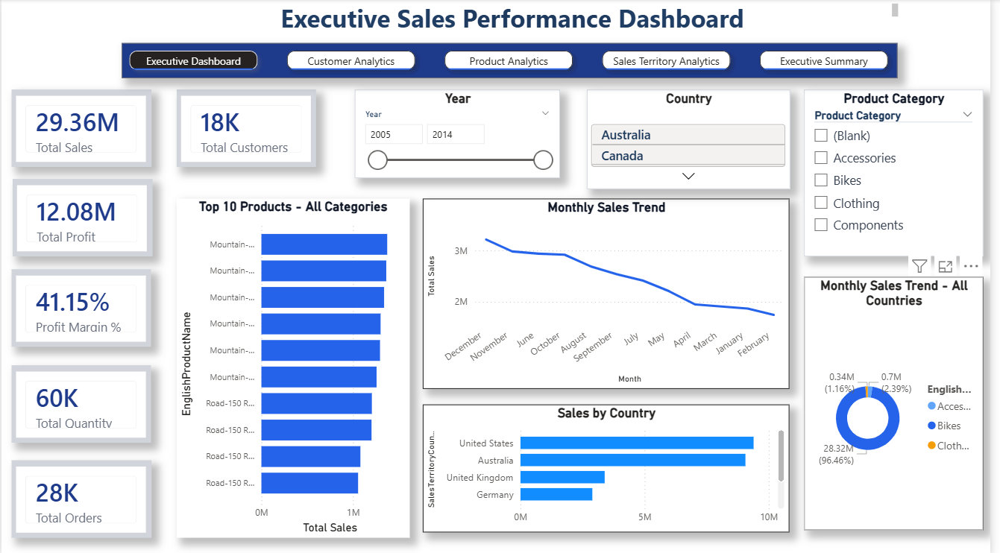
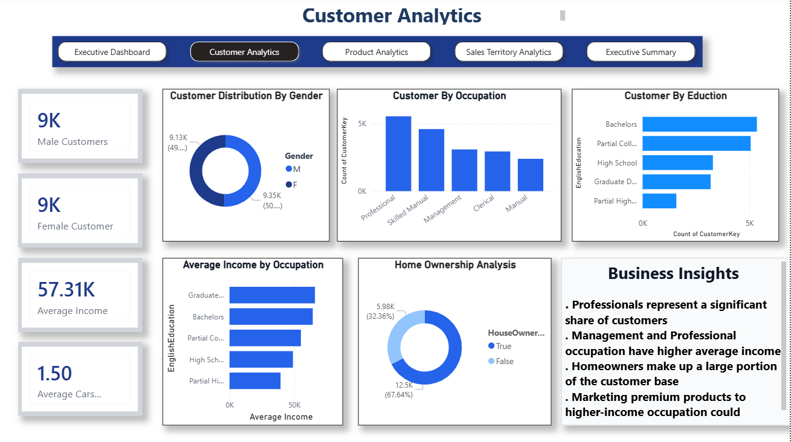
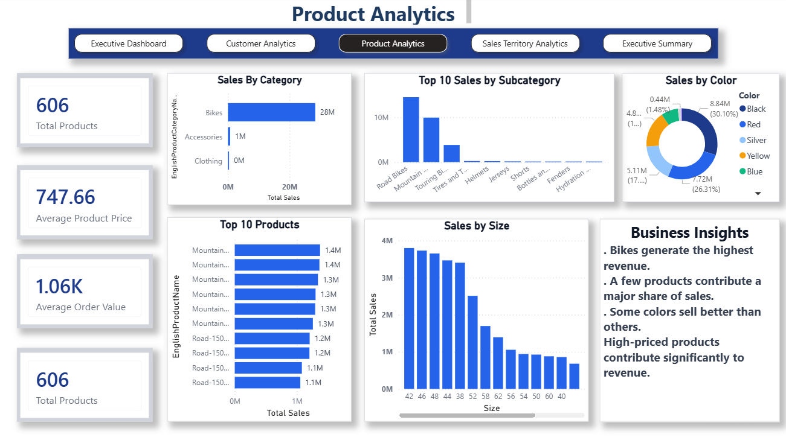
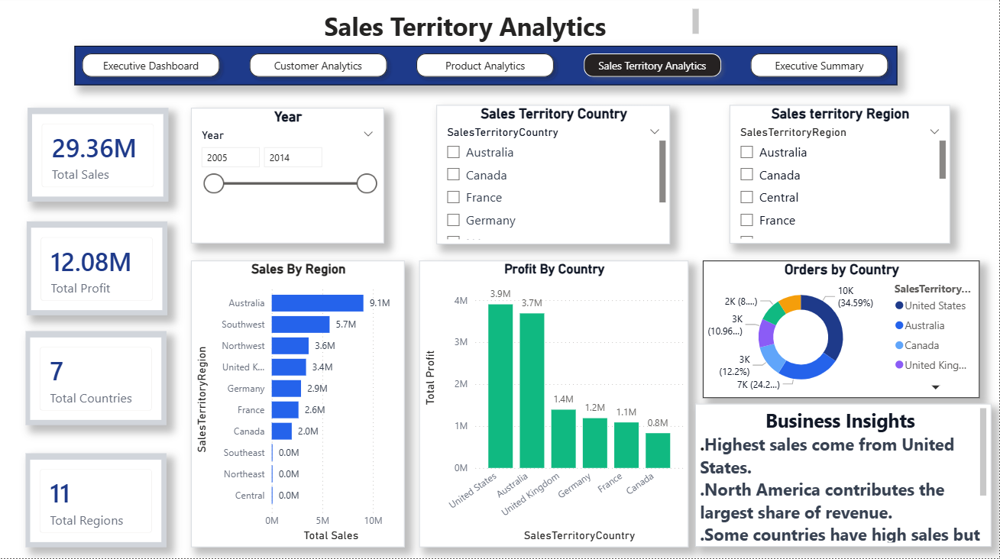
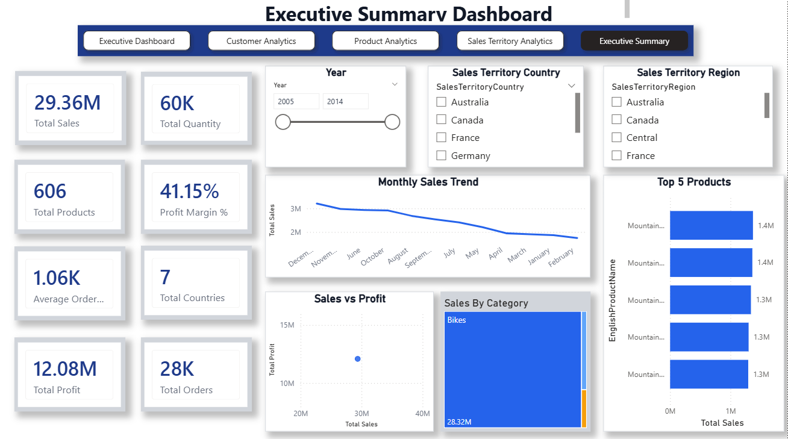

# Executive Sales Intelligence Dashboard

## 📊 Project Overview

An interactive Power BI dashboard designed to analyze sales,
customer, product, and sales territory performance.

The dashboard provides business insights through interactive
KPIs, charts, slicers, navigation and analytical visuals.

## 🛠️ Tools & Technologies

- Power BI
- Power Query
- DAX
- Data Cleaning
- Data Visualization
- Business Intelligence

## 📑 Dashboard Pages

### 1. Executive Dashboard

Provides an overview of key business KPIs including:

- Total Sales
- Total Profit
- Total Customers
- Total Orders
- Total Quantity
- Monthly Sales Trend
- Top Products
- Sales by Country
- Sales by Category

### 2. Customer Analytics

Analyzes customer characteristics including:

- Customer distribution by gender
- Customer occupation
- Education
- Average income
- Home ownership
- Average cars owned

### 3. Product Analytics

Analyzes product performance including:

- Sales by category
- Sales by subcategory
- Top products
- Sales by color
- Sales by size

### 4. Sales Territory Analytics

Analyzes geographical performance including:

- Sales by region
- Profit by country
- Orders by country
- Sales territory country
- Sales territory region

### 5. Executive Summary

Provides a consolidated business overview including:

- Monthly sales trend
- Top 5 products
- Sales vs Profit
- Sales by category
- Key business KPIs

## 📈 Key Business Insights

- Bikes contribute the largest share of total sales.
- A small number of products contribute significantly to revenue.
- Professional and management occupations represent important customer segments.
- The United States contributes strongly to overall sales.
- Sales and profit performance varies across countries and regions.
- Interactive filters allow users to analyze different business segments.

## 🎯 Skills Demonstrated

- Data Cleaning
- Data Transformation
- Data Modeling
- DAX Measures
- KPI Development
- Data Visualization
- Business Intelligence
- Dashboard Design
- Interactive Reporting

## 📸 Dashboard Preview

### Executive Dashboard

### Customer Analytics

### Product Analytics

### Sales Territory Analytics

### Executive Summary

## 📁 Project Files

- `Executive Sales Intelligence Dashboard.pbix` — Power BI project file
- Dashboard screenshots
- Project documentation

## 👨‍💻 Project Type

Data Analytics / Business Intelligence Portfolio Project
